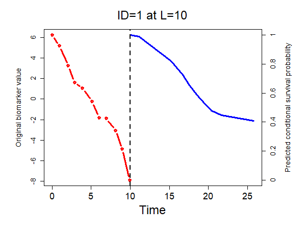
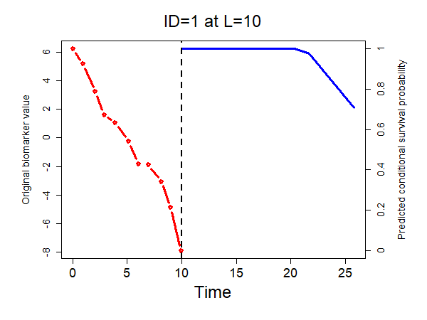

# curedynpred

curedynpred is an R package to predict individual conditional cure rates and conditional 
survival probabilities by using our proposed cure models in joint modeling and landmark frameworks. 
The proposed cure models are built on a flexible-hazards cure (FHC) model, which belongs to the promotion time cure model. The FHC model is an extension of the proportional hazards cure (PHC) model. The estimation of the FHC model is available at https://github.com/cxie19/fhc.
The proposed joint cure model simultaneously deals with longitudinal data in a linear mixed-effects model and flexible patterns of hazard ratios over time in an FHC model. 
Individual random effects connect the two parts. 
This proposed joint model is a joint model with a flexible-hazards cure model for survival data (JMFHC). The model estimation of JMFHC can be found at https://github.com/cxie19/jmfhc.
The proposed FHC model in the landmark framework incorporates longitudinal biomarker values by including the baseline biomarker values and the most current biomarker values as covariates. This proposed landmark model is a landmark FHC (LFHC) model.
The proposed JMFHC and LFHC model accommodate some covariates following the proportional hazards (PH) assumption and other covariates violating the PH assumption while incorporating patients' longitudinal biomarker values. 
This package can also be used to predict the conditional cure and survival probabilities by using a joint model with a proportional hazards cure model for survival data (JMPHC) and a landmark PHC (LPHC) model, which are the speical case of JMFHC and a LFHC model, respectively.

## How to get started

Install the R package using the following commands on the R console:

```{r}
install.packages("devtools")
devtools::install_github("cxie19/curedynpred")
library(curedynpred)
```

Example data sets called *train_dat* and *test_dat* are provided in this package as the training set and test set, respectively. 
The test dataset contains information of all patients for prediction. They are longitudinal and cure-survival data sets. Their documentations can be seen by using the following command.

```{r}
help(train_dat)
help(test_dat)
```

The function *pred_cure_joint_model* is called to predict individual conditional probability of being cured at a landmark time by using JMFHC or JMPHC.
Its documentation can be seen by using the following command.

```{r}
help(pred_cure_joint_model)
```

The function *pred_surv_joint_model* is called to predict individual conditional probability of not experiencing the event of
interest in an additional time given that a patient remains risk-free at least until a landmark time by using JMFHC or JMPHC.
Its documentation can be seen by using the following command.

```{r}
help(pred_surv_joint_model)
```
Similarly, the function *pred_landmark_model* is called to predict individual conditional cure and (or) survival probability at a landmark time by using a LFHC or LPHC model.
Its documentation can be seen by using the following command.

```{r}
help(pred_landmark_model)
```

The function *plot_con_surv* is called to plot a patient's observed biomarker values up to a landmark time and the predicted individual conditional survival function at the landmark time

```{r}
help(plot_con_surv)
```

The function *runDynShiny* is called to initiate the R Shiny Web App. It can predict conditional 
cure probability and conditional survival probability of a new patient.
Its documentation can be seen by using the following command.

```{r}
help(runDynShiny)
```


## Example
For example, we want to fit a JMFHC for the example training data *train_dat* and predict patients in the example test data *test_dat*.
This joint model has repeatedly measured biomarker values as the outcome of the 
longitudinal submodel with measurement times as the 
covariate and treatment as the short- and long-term covariate in the cure 
submodel. These two submodels share individual random effects.
The time unit for the time-related variables is month.

We call the function *jmfhc_point_est* for point estimation from the R package cxie19/jmfhc, and the following command is used.

```{r}
jmfhc_est <- jmfhc::jmfhc_point_est(data=train_dat, event_time="event.time", event_status="event",                                                                        id="id", beta_variable=c("x1","x2"), gamma_variable=c("x1","x2"),                                                                      fu_measure_original="measure",fu_measure="measure",                                                                                    fu_time_original="measure.time",fu_time_fixed_variable="measure.time",                                                                 fu_time_random_variable="measure.time",baseline_var_lmm=c("x1","x2"),no_cores=7)
```
The point estimation could be found as a file called jmfhc_estresult.rds.

To predict conditional cure rates at 10 and 20 months for all patients who are still at risk at 10 and 20 months in the test dataset, respectively, we call the function *pred_cure_joint_model*.

```{r}
predict_cure_jmfhc  <- pred_cure_joint_model(landmark_cure_vec =c(10,20),
                                             object=jmfhc_estresult,
                                             test_dat=test_dat,
                                             no_cores=7)
```

To predict all patients' conditional probability of not experiencing the event of interest in an additional 5 and 10 months 
given that the patient remains risk-free at least 10 and 20 months, we call the function *pred_surv_joint_model*. 

```{r}
predict_surv_jmfhc  <- pred_surv_joint_model(landmark_surv_vec=c(10,20),
                                             thor_list=list(c(5,10),c(5,10)),
                                             object=jmfhc_est,
                                             test_dat=test_dat,
                                             no_cores=7)
```

The prediction result could be found as a file called predict_surv_jmfhc.rds.
We plot the biomarker values and predicted survival function at 10 months for patient with ID=1.

```{r}
predict_cure_one <- est_cure_L(L=10,predict.id="one",predict.id.one=3,object=result_jmfhc)
predict_surv_one <- est_con_survival(L=10,t_hor=5,predict.id="one",predict.id.one=3,AUC=FALSE,Brier=FALSE,object=result_jmfhc)
```

We plot this patient's observed biomarker measurements up to the landmark time 10 months and the predicted individual conditional probability function at 10 months. 

```{r}
png("plot_jmfhc_id1.png",width = 600, height = 450)
plot_con_surv(landmark=10,predict.id=1,model.type="joint model",object=predict_surv_jmfhc,original_biomarker_form=TRUE,no_cores=7)
dev.off()
```



Similarly, we fit an LFHC model on the training data and predict patients in the test data.
```{r}
lfhc_pred_all <- pred_landmark_model(cure_prob=T,landmark_cure_vec=c(10,20),
                                     surv_prob=T,landmark_surv_vec=c(10,20),
                                     thor_list=list(c(5,10),c(5,10)),
                                     train_prep_data=train_dat,test_prep_data=test_dat,
                                     id="id",event_time="event.time",event_status = "event",
                                     fu_time_original="measure.time",
                                     fu_measure_original="measure",fu_measure="measure",
                                     beta_variable = c("x1","x2"),
                                     gamma_include_measure=FALSE,
                                     gamma_variable= c("x1","x2"))
```
We make the plot for patient with ID=1 at the landmark 10 months.
```{r}
png("plot_lfhc_id1.png",width = 600, height = 450)
plot_con_surv(landmark=10,predict.id=1,model.type="landmark model",object=lfhc_pred_all,original_biomarker_form=TRUE,no_cores=7)
dev.off()
```


